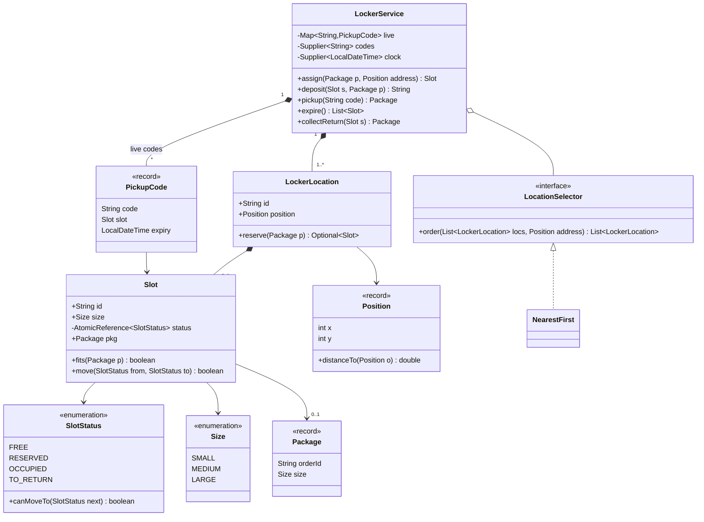

# Amazon Locker: class diagram

```mermaid
classDiagram
    class LockerService {
        -Map~String,PickupCode~ live
        -Supplier~String~ codes
        -Supplier~LocalDateTime~ clock
        +assign(Package p, Position address) Slot
        +deposit(Slot s, Package p) String
        +pickup(String code) Package
        +expire() List~Slot~
        +collectReturn(Slot s) Package
    }
    class LockerLocation {
        +String id
        +Position position
        +reserve(Package p) Optional~Slot~
    }
    class Slot {
        +String id
        +Size size
        -AtomicReference~SlotStatus~ status
        +Package pkg
        +fits(Package p) boolean
        +move(SlotStatus from, SlotStatus to) boolean
    }
    class SlotStatus {
        <<enumeration>>
        FREE
        RESERVED
        OCCUPIED
        TO_RETURN
        +canMoveTo(SlotStatus next) boolean
    }
    class Size {
        <<enumeration>>
        SMALL
        MEDIUM
        LARGE
    }
    class Package {
        <<record>>
        String orderId
        Size size
    }
    class Position {
        <<record>>
        int x
        int y
        +distanceTo(Position o) double
    }
    class PickupCode {
        <<record>>
        String code
        Slot slot
        LocalDateTime expiry
    }
    class LocationSelector {
        <<interface>>
        +order(List~LockerLocation~ locs, Position address) List~LockerLocation~
    }

    LockerService "1" *-- "1..*" LockerLocation
    LockerService o-- LocationSelector
    LockerService "1" *-- "*" PickupCode : live codes
    LockerLocation "1" *-- "1..*" Slot
    LockerLocation --> Position
    PickupCode --> Slot
    Slot --> SlotStatus
    Slot --> Size
    Slot --> "0..1" Package
    LocationSelector <|.. NearestFirst
```
