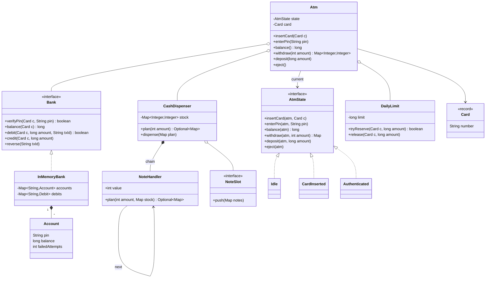

# ATM: class diagram

```mermaid
classDiagram
    class Atm {
        -AtmState state
        -Card card
        +insertCard(Card c)
        +enterPin(String pin)
        +balance() long
        +withdraw(int amount) Map~Integer,Integer~
        +deposit(long amount)
        +eject()
    }
    class AtmState {
        <<interface>>
        +insertCard(atm, Card c)
        +enterPin(atm, String pin)
        +balance(atm) long
        +withdraw(atm, int amount) Map
        +deposit(atm, long amount)
        +eject(atm)
    }
    class Bank {
        <<interface>>
        +verifyPin(Card c, String pin) boolean
        +balance(Card c) long
        +debit(Card c, long amount, String txId) boolean
        +credit(Card c, long amount)
        +reverse(String txId)
    }
    class InMemoryBank {
        -Map~String,Account~ accounts
        -Map~String,Debit~ debits
    }
    class Account {
        String pin
        long balance
        int failedAttempts
    }
    class CashDispenser {
        -Map~Integer,Integer~ stock
        +plan(int amount) Optional~Map~
        +dispense(Map plan)
    }
    class NoteHandler {
        +int value
        +plan(int amount, Map stock) Optional~Map~
    }
    class NoteSlot {
        <<interface>>
        +push(Map notes)
    }
    class DailyLimit {
        -long limit
        +tryReserve(Card c, long amount) boolean
        +release(Card c, long amount)
    }
    class Card {
        <<record>>
        String number
    }

    Atm --> AtmState : current
    AtmState <|.. Idle
    AtmState <|.. CardInserted
    AtmState <|.. Authenticated
    Atm o-- Bank
    Atm o-- CashDispenser
    Atm o-- DailyLimit
    Atm --> Card
    Bank <|.. InMemoryBank
    InMemoryBank "1" *-- "*" Account
    CashDispenser *-- NoteHandler : chain
    NoteHandler --> NoteHandler : next
    CashDispenser o-- NoteSlot
```
