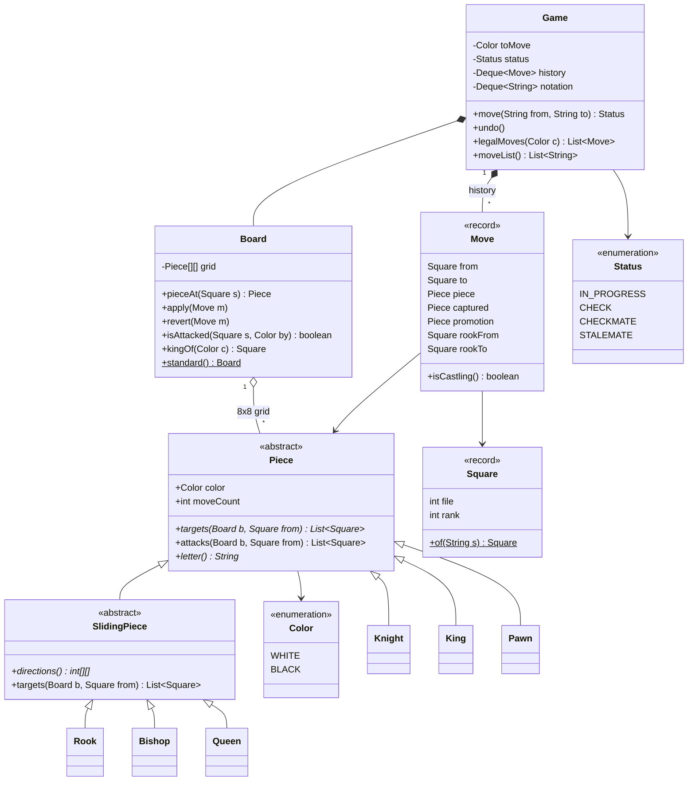

# Chess: class diagram

```mermaid
classDiagram
    class Game {
        -Color toMove
        -Status status
        -Deque~Move~ history
        -Deque~String~ notation
        +move(String from, String to) Status
        +undo()
        +legalMoves(Color c) List~Move~
        +moveList() List~String~
    }
    class Board {
        -Piece[][] grid
        +pieceAt(Square s) Piece
        +apply(Move m)
        +revert(Move m)
        +isAttacked(Square s, Color by) boolean
        +kingOf(Color c) Square
        +standard()$ Board
    }
    class Piece {
        <<abstract>>
        +Color color
        +int moveCount
        +targets(Board b, Square from)* List~Square~
        +attacks(Board b, Square from) List~Square~
        +letter()* String
    }
    class SlidingPiece {
        <<abstract>>
        +directions()* int[][]
        +targets(Board b, Square from) List~Square~
    }
    class Move {
        <<record>>
        Square from
        Square to
        Piece piece
        Piece captured
        Piece promotion
        Square rookFrom
        Square rookTo
        +isCastling() boolean
    }
    class Square {
        <<record>>
        int file
        int rank
        +of(String s)$ Square
    }
    class Color {
        <<enumeration>>
        WHITE
        BLACK
    }
    class Status {
        <<enumeration>>
        IN_PROGRESS
        CHECK
        CHECKMATE
        STALEMATE
    }

    Game *-- Board
    Game "1" *-- "*" Move : history
    Game --> Status
    Board "1" o-- "*" Piece : 8x8 grid
    Piece --> Color
    Piece <|-- SlidingPiece
    SlidingPiece <|-- Rook
    SlidingPiece <|-- Bishop
    SlidingPiece <|-- Queen
    Piece <|-- Knight
    Piece <|-- King
    Piece <|-- Pawn
    Move --> Square
    Move --> Piece
```
