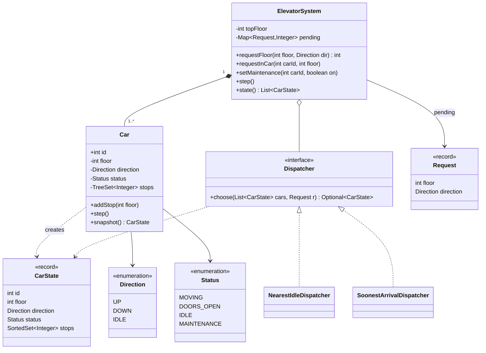

# Elevator System: class diagram

```mermaid
classDiagram
    class ElevatorSystem {
        -int topFloor
        -Map~Request,Integer~ pending
        +requestFloor(int floor, Direction dir) int
        +requestInCar(int carId, int floor)
        +setMaintenance(int carId, boolean on)
        +step()
        +state() List~CarState~
    }
    class Car {
        +int id
        -int floor
        -Direction direction
        -Status status
        -TreeSet~Integer~ stops
        +addStop(int floor)
        +step()
        +snapshot() CarState
    }
    class Dispatcher {
        <<interface>>
        +choose(List~CarState~ cars, Request r) Optional~CarState~
    }
    class Request {
        <<record>>
        int floor
        Direction direction
    }
    class CarState {
        <<record>>
        int id
        int floor
        Direction direction
        Status status
        SortedSet~Integer~ stops
    }
    class Direction {
        <<enumeration>>
        UP
        DOWN
        IDLE
    }
    class Status {
        <<enumeration>>
        MOVING
        DOORS_OPEN
        IDLE
        MAINTENANCE
    }

    ElevatorSystem "1" *-- "1..*" Car
    ElevatorSystem o-- Dispatcher
    ElevatorSystem --> Request : pending
    Car ..> CarState : creates
    Dispatcher ..> CarState : reads
    Dispatcher <|.. NearestIdleDispatcher
    Dispatcher <|.. SoonestArrivalDispatcher
    Car --> Direction
    Car --> Status
```
