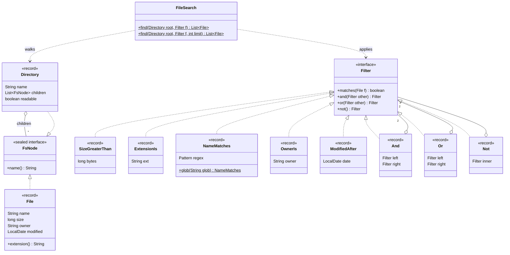

# File Search: class diagram

```mermaid
classDiagram
    class FileSearch {
        +find(Directory root, Filter f)$ List~File~
        +find(Directory root, Filter f, int limit)$ List~File~
    }
    class FsNode {
        <<sealed interface>>
        +name() String
    }
    class File {
        <<record>>
        String name
        long size
        String owner
        LocalDate modified
        +extension() String
    }
    class Directory {
        <<record>>
        String name
        List~FsNode~ children
        boolean readable
    }
    class Filter {
        <<interface>>
        +matches(File f) boolean
        +and(Filter other) Filter
        +or(Filter other) Filter
        +not() Filter
    }
    class SizeGreaterThan {
        <<record>>
        long bytes
    }
    class ExtensionIs {
        <<record>>
        String ext
    }
    class NameMatches {
        <<record>>
        Pattern regex
        +glob(String glob)$ NameMatches
    }
    class OwnerIs {
        <<record>>
        String owner
    }
    class ModifiedAfter {
        <<record>>
        LocalDate date
    }
    class And {
        <<record>>
        Filter left
        Filter right
    }
    class Or {
        <<record>>
        Filter left
        Filter right
    }
    class Not {
        <<record>>
        Filter inner
    }

    FsNode <|.. File
    FsNode <|.. Directory
    Directory o-- "*" FsNode : children
    FileSearch ..> Directory : walks
    FileSearch ..> Filter : applies
    Filter <|.. SizeGreaterThan
    Filter <|.. ExtensionIs
    Filter <|.. NameMatches
    Filter <|.. OwnerIs
    Filter <|.. ModifiedAfter
    Filter <|.. And
    Filter <|.. Or
    Filter <|.. Not
    And o-- "2" Filter
    Or o-- "2" Filter
    Not o-- "1" Filter
```
