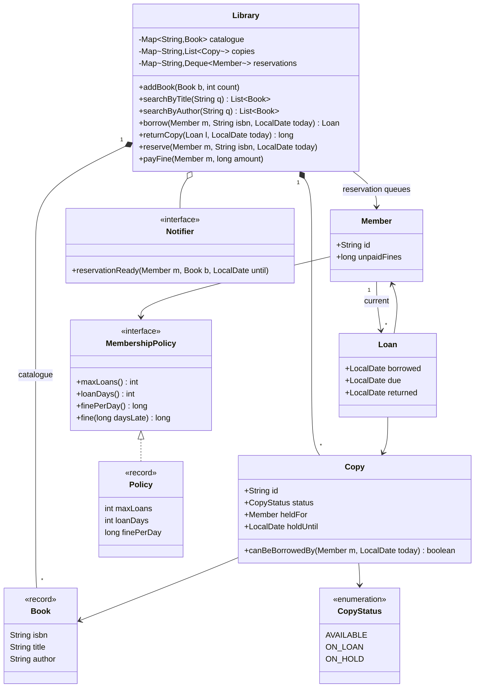

# Library Management: class diagram

```mermaid
classDiagram
    class Library {
        -Map~String,Book~ catalogue
        -Map~String,List~Copy~~ copies
        -Map~String,Deque~Member~~ reservations
        +addBook(Book b, int count)
        +searchByTitle(String q) List~Book~
        +searchByAuthor(String q) List~Book~
        +borrow(Member m, String isbn, LocalDate today) Loan
        +returnCopy(Loan l, LocalDate today) long
        +reserve(Member m, String isbn, LocalDate today)
        +payFine(Member m, long amount)
    }
    class Book {
        <<record>>
        String isbn
        String title
        String author
    }
    class Copy {
        +String id
        +CopyStatus status
        +Member heldFor
        +LocalDate holdUntil
        +canBeBorrowedBy(Member m, LocalDate today) boolean
    }
    class CopyStatus {
        <<enumeration>>
        AVAILABLE
        ON_LOAN
        ON_HOLD
    }
    class Member {
        +String id
        +long unpaidFines
    }
    class Loan {
        +LocalDate borrowed
        +LocalDate due
        +LocalDate returned
    }
    class MembershipPolicy {
        <<interface>>
        +maxLoans() int
        +loanDays() int
        +finePerDay() long
        +fine(long daysLate) long
    }
    class Policy {
        <<record>>
        int maxLoans
        int loanDays
        long finePerDay
    }
    class Notifier {
        <<interface>>
        +reservationReady(Member m, Book b, LocalDate until)
    }

    Library "1" *-- "*" Book : catalogue
    Library "1" *-- "*" Copy
    Library --> Member : reservation queues
    Library o-- Notifier
    Copy --> Book
    Copy --> CopyStatus
    Member --> MembershipPolicy
    Member "1" --> "*" Loan : current
    Loan --> Copy
    Loan --> Member
    MembershipPolicy <|.. Policy
```
