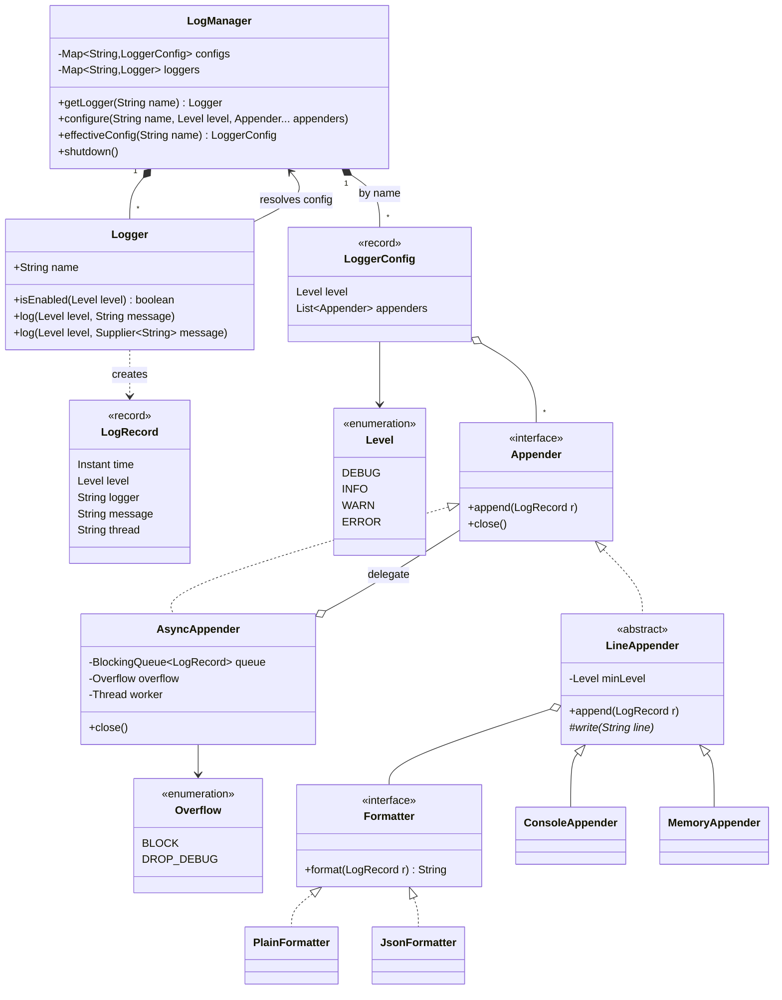

# Logging Framework: class diagram

```mermaid
classDiagram
    class LogManager {
        -Map~String,LoggerConfig~ configs
        -Map~String,Logger~ loggers
        +getLogger(String name) Logger
        +configure(String name, Level level, Appender... appenders)
        +effectiveConfig(String name) LoggerConfig
        +shutdown()
    }
    class Logger {
        +String name
        +isEnabled(Level level) boolean
        +log(Level level, String message)
        +log(Level level, Supplier~String~ message)
    }
    class LoggerConfig {
        <<record>>
        Level level
        List~Appender~ appenders
    }
    class LogRecord {
        <<record>>
        Instant time
        Level level
        String logger
        String message
        String thread
    }
    class Level {
        <<enumeration>>
        DEBUG
        INFO
        WARN
        ERROR
    }
    class Appender {
        <<interface>>
        +append(LogRecord r)
        +close()
    }
    class LineAppender {
        <<abstract>>
        -Level minLevel
        +append(LogRecord r)
        #write(String line)*
    }
    class AsyncAppender {
        -BlockingQueue~LogRecord~ queue
        -Overflow overflow
        -Thread worker
        +close()
    }
    class Overflow {
        <<enumeration>>
        BLOCK
        DROP_DEBUG
    }
    class Formatter {
        <<interface>>
        +format(LogRecord r) String
    }

    LogManager "1" *-- "*" Logger
    LogManager "1" *-- "*" LoggerConfig : by name
    Logger --> LogManager : resolves config
    LoggerConfig --> Level
    LoggerConfig o-- "*" Appender
    Logger ..> LogRecord : creates
    Appender <|.. LineAppender
    Appender <|.. AsyncAppender
    LineAppender <|-- ConsoleAppender
    LineAppender <|-- MemoryAppender
    LineAppender o-- Formatter
    AsyncAppender o-- Appender : delegate
    AsyncAppender --> Overflow
    Formatter <|.. PlainFormatter
    Formatter <|.. JsonFormatter
```
