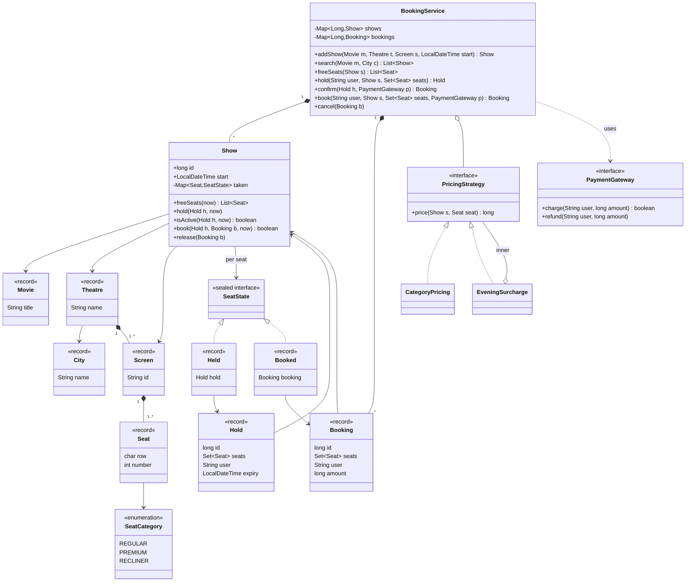

# Movie Ticket Booking: class diagram

```mermaid
classDiagram
    class BookingService {
        -Map~Long,Show~ shows
        -Map~Long,Booking~ bookings
        +addShow(Movie m, Theatre t, Screen s, LocalDateTime start) Show
        +search(Movie m, City c) List~Show~
        +freeSeats(Show s) List~Seat~
        +hold(String user, Show s, Set~Seat~ seats) Hold
        +confirm(Hold h, PaymentGateway p) Booking
        +book(String user, Show s, Set~Seat~ seats, PaymentGateway p) Booking
        +cancel(Booking b)
    }
    class Show {
        +long id
        +LocalDateTime start
        -Map~Seat,SeatState~ taken
        +freeSeats(now) List~Seat~
        +hold(Hold h, now)
        +isActive(Hold h, now) boolean
        +book(Hold h, Booking b, now) boolean
        +release(Booking b)
    }
    class SeatState {
        <<sealed interface>>
    }
    class Held {
        <<record>>
        Hold hold
    }
    class Booked {
        <<record>>
        Booking booking
    }
    class Theatre {
        <<record>>
        String name
    }
    class Screen {
        <<record>>
        String id
    }
    class Seat {
        <<record>>
        char row
        int number
    }
    class SeatCategory {
        <<enumeration>>
        REGULAR
        PREMIUM
        RECLINER
    }
    class Movie {
        <<record>>
        String title
    }
    class City {
        <<record>>
        String name
    }
    class Hold {
        <<record>>
        long id
        Set~Seat~ seats
        String user
        LocalDateTime expiry
    }
    class Booking {
        <<record>>
        long id
        Set~Seat~ seats
        String user
        long amount
    }
    class PricingStrategy {
        <<interface>>
        +price(Show s, Seat seat) long
    }
    class PaymentGateway {
        <<interface>>
        +charge(String user, long amount) boolean
        +refund(String user, long amount)
    }

    BookingService "1" *-- "*" Show
    BookingService "1" *-- "*" Booking
    BookingService o-- PricingStrategy
    BookingService ..> PaymentGateway : uses
    Show --> Movie
    Show --> Theatre
    Show --> Screen
    Show --> SeatState : per seat
    Theatre --> City
    Theatre "1" *-- "1..*" Screen
    Screen "1" *-- "1..*" Seat
    Seat --> SeatCategory
    SeatState <|.. Held
    SeatState <|.. Booked
    Held --> Hold
    Booked --> Booking
    Hold --> Show
    Booking --> Show
    PricingStrategy <|.. CategoryPricing
    PricingStrategy <|.. EveningSurcharge
    EveningSurcharge o-- PricingStrategy : inner
```
