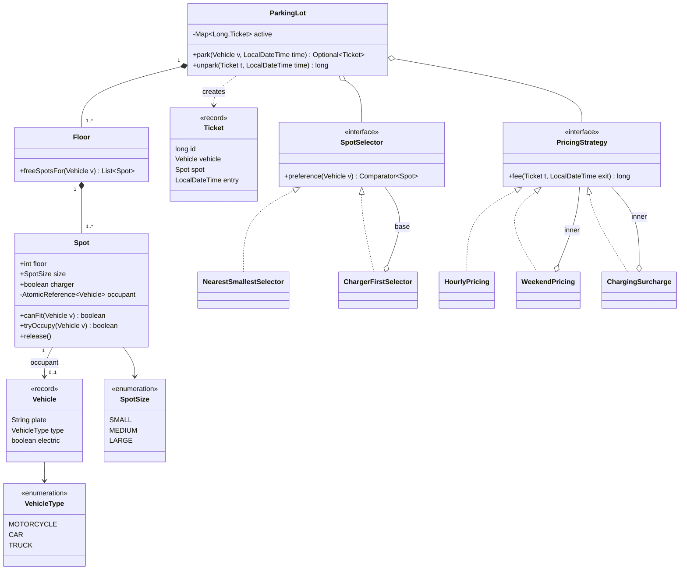

# Parking Lot: class diagram

```mermaid
classDiagram
    class ParkingLot {
        -Map~Long,Ticket~ active
        +park(Vehicle v, LocalDateTime time) Optional~Ticket~
        +unpark(Ticket t, LocalDateTime time) long
    }
    class Floor {
        +freeSpotsFor(Vehicle v) List~Spot~
    }
    class Spot {
        +int floor
        +SpotSize size
        +boolean charger
        -AtomicReference~Vehicle~ occupant
        +canFit(Vehicle v) boolean
        +tryOccupy(Vehicle v) boolean
        +release()
    }
    class Vehicle {
        <<record>>
        String plate
        VehicleType type
        boolean electric
    }
    class Ticket {
        <<record>>
        long id
        Vehicle vehicle
        Spot spot
        LocalDateTime entry
    }
    class SpotSelector {
        <<interface>>
        +preference(Vehicle v) Comparator~Spot~
    }
    class PricingStrategy {
        <<interface>>
        +fee(Ticket t, LocalDateTime exit) long
    }
    class SpotSize {
        <<enumeration>>
        SMALL
        MEDIUM
        LARGE
    }
    class VehicleType {
        <<enumeration>>
        MOTORCYCLE
        CAR
        TRUCK
    }

    ParkingLot "1" *-- "1..*" Floor
    Floor "1" *-- "1..*" Spot
    ParkingLot o-- SpotSelector
    ParkingLot o-- PricingStrategy
    ParkingLot ..> Ticket : creates
    Spot "1" --> "0..1" Vehicle : occupant
    Spot --> SpotSize
    Vehicle --> VehicleType
    SpotSelector <|.. NearestSmallestSelector
    SpotSelector <|.. ChargerFirstSelector
    ChargerFirstSelector o-- SpotSelector : base
    PricingStrategy <|.. HourlyPricing
    PricingStrategy <|.. WeekendPricing
    PricingStrategy <|.. ChargingSurcharge
    WeekendPricing o-- PricingStrategy : inner
    ChargingSurcharge o-- PricingStrategy : inner
```
