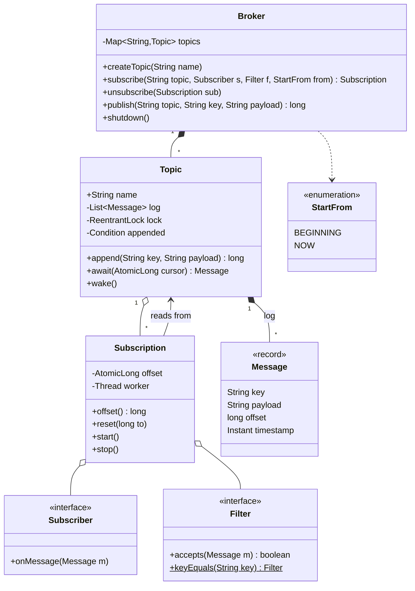

# Pub-Sub System: class diagram

```mermaid
classDiagram
    class Broker {
        -Map~String,Topic~ topics
        +createTopic(String name)
        +subscribe(String topic, Subscriber s, Filter f, StartFrom from) Subscription
        +unsubscribe(Subscription sub)
        +publish(String topic, String key, String payload) long
        +shutdown()
    }
    class Topic {
        +String name
        -List~Message~ log
        -ReentrantLock lock
        -Condition appended
        +append(String key, String payload) long
        +await(AtomicLong cursor) Message
        +wake()
    }
    class Subscription {
        -AtomicLong offset
        -Thread worker
        +offset() long
        +reset(long to)
        +start()
        +stop()
    }
    class Message {
        <<record>>
        String key
        String payload
        long offset
        Instant timestamp
    }
    class Subscriber {
        <<interface>>
        +onMessage(Message m)
    }
    class Filter {
        <<interface>>
        +accepts(Message m) boolean
        +keyEquals(String key)$ Filter
    }
    class StartFrom {
        <<enumeration>>
        BEGINNING
        NOW
    }

    Broker "1" *-- "*" Topic
    Topic "1" *-- "*" Message : log
    Topic "1" o-- "*" Subscription
    Subscription --> Topic : reads from
    Subscription o-- Subscriber
    Subscription o-- Filter
    Broker ..> StartFrom
```
