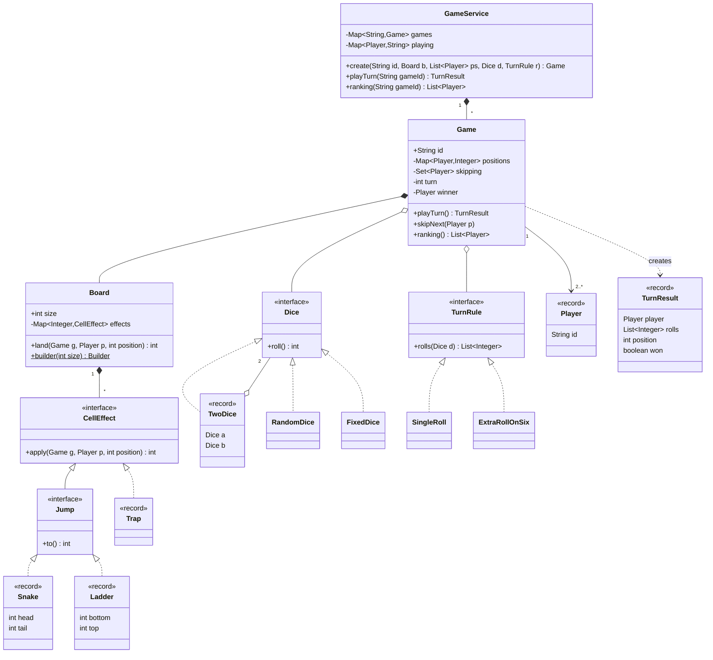

# Snake and Ladder: class diagram

```mermaid
classDiagram
    class GameService {
        -Map~String,Game~ games
        -Map~Player,String~ playing
        +create(String id, Board b, List~Player~ ps, Dice d, TurnRule r) Game
        +playTurn(String gameId) TurnResult
        +ranking(String gameId) List~Player~
    }
    class Game {
        +String id
        -Map~Player,Integer~ positions
        -Set~Player~ skipping
        -int turn
        -Player winner
        +playTurn() TurnResult
        +skipNext(Player p)
        +ranking() List~Player~
    }
    class Board {
        +int size
        -Map~Integer,CellEffect~ effects
        +land(Game g, Player p, int position) int
        +builder(int size)$ Builder
    }
    class CellEffect {
        <<interface>>
        +apply(Game g, Player p, int position) int
    }
    class Jump {
        <<interface>>
        +to() int
    }
    class Snake {
        <<record>>
        int head
        int tail
    }
    class Ladder {
        <<record>>
        int bottom
        int top
    }
    class Trap {
        <<record>>
    }
    class Dice {
        <<interface>>
        +roll() int
    }
    class TwoDice {
        <<record>>
        Dice a
        Dice b
    }
    class TurnRule {
        <<interface>>
        +rolls(Dice d) List~Integer~
    }
    class Player {
        <<record>>
        String id
    }
    class TurnResult {
        <<record>>
        Player player
        List~Integer~ rolls
        int position
        boolean won
    }

    GameService "1" *-- "*" Game
    Game *-- Board
    Game "1" --> "2..*" Player
    Game o-- Dice
    Game o-- TurnRule
    Game ..> TurnResult : creates
    Board "1" *-- "*" CellEffect
    CellEffect <|-- Jump
    Jump <|.. Snake
    Jump <|.. Ladder
    CellEffect <|.. Trap
    Dice <|.. RandomDice
    Dice <|.. FixedDice
    Dice <|.. TwoDice
    TwoDice o-- "2" Dice
    TurnRule <|.. SingleRoll
    TurnRule <|.. ExtraRollOnSix
```
