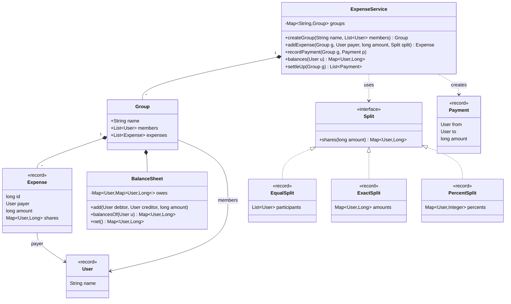

# Splitwise: class diagram

```mermaid
classDiagram
    class ExpenseService {
        -Map~String,Group~ groups
        +createGroup(String name, List~User~ members) Group
        +addExpense(Group g, User payer, long amount, Split split) Expense
        +recordPayment(Group g, Payment p)
        +balances(User u) Map~User,Long~
        +settleUp(Group g) List~Payment~
    }
    class Group {
        +String name
        +List~User~ members
        +List~Expense~ expenses
    }
    class BalanceSheet {
        -Map~User,Map~User,Long~~ owes
        +add(User debtor, User creditor, long amount)
        +balancesOf(User u) Map~User,Long~
        +net() Map~User,Long~
    }
    class Split {
        <<interface>>
        +shares(long amount) Map~User,Long~
    }
    class EqualSplit {
        <<record>>
        List~User~ participants
    }
    class ExactSplit {
        <<record>>
        Map~User,Long~ amounts
    }
    class PercentSplit {
        <<record>>
        Map~User,Integer~ percents
    }
    class Expense {
        <<record>>
        long id
        User payer
        long amount
        Map~User,Long~ shares
    }
    class Payment {
        <<record>>
        User from
        User to
        long amount
    }
    class User {
        <<record>>
        String name
    }

    ExpenseService "1" *-- "*" Group
    Group "1" *-- "*" Expense
    Group *-- BalanceSheet
    Group --> User : members
    ExpenseService ..> Split : uses
    ExpenseService ..> Payment : creates
    Split <|.. EqualSplit
    Split <|.. ExactSplit
    Split <|.. PercentSplit
    Expense --> User : payer
```
