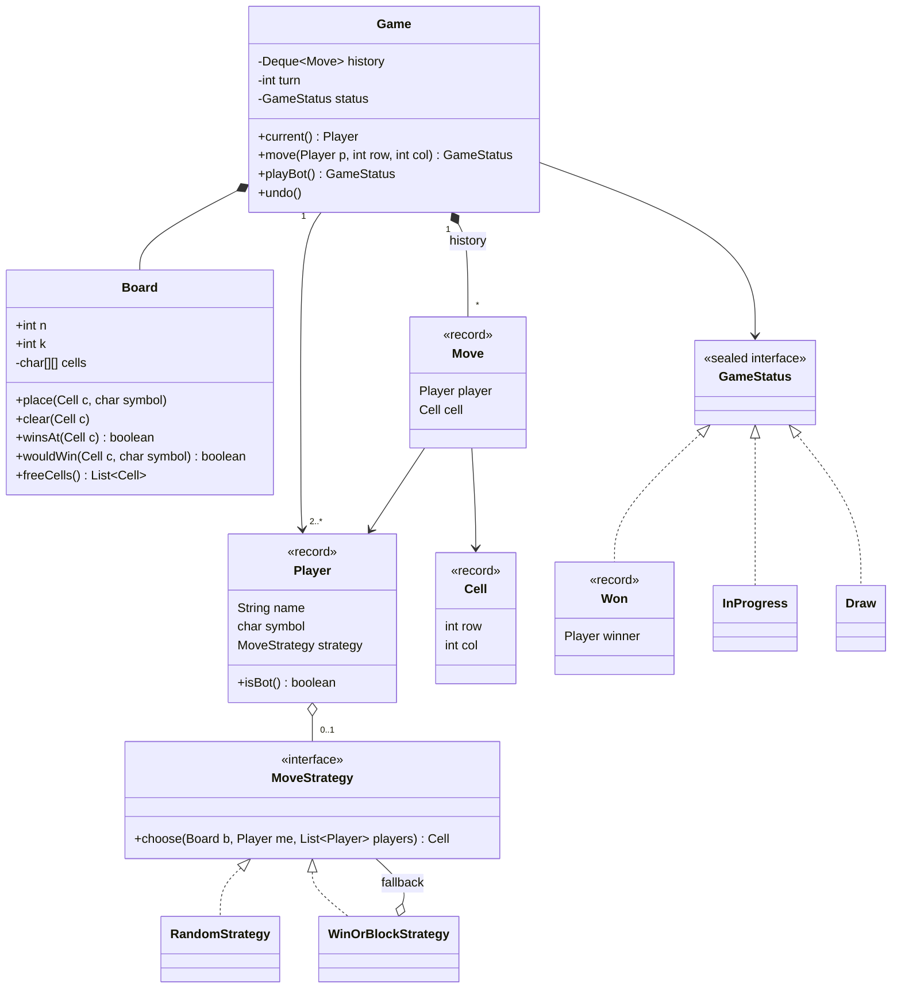

# Tic-Tac-Toe: class diagram

```mermaid
classDiagram
    class Game {
        -Deque~Move~ history
        -int turn
        -GameStatus status
        +current() Player
        +move(Player p, int row, int col) GameStatus
        +playBot() GameStatus
        +undo()
    }
    class Board {
        +int n
        +int k
        -char[][] cells
        +place(Cell c, char symbol)
        +clear(Cell c)
        +winsAt(Cell c) boolean
        +wouldWin(Cell c, char symbol) boolean
        +freeCells() List~Cell~
    }
    class Player {
        <<record>>
        String name
        char symbol
        MoveStrategy strategy
        +isBot() boolean
    }
    class Move {
        <<record>>
        Player player
        Cell cell
    }
    class Cell {
        <<record>>
        int row
        int col
    }
    class GameStatus {
        <<sealed interface>>
    }
    class Won {
        <<record>>
        Player winner
    }
    class MoveStrategy {
        <<interface>>
        +choose(Board b, Player me, List~Player~ players) Cell
    }

    Game *-- Board
    Game "1" --> "2..*" Player
    Game "1" *-- "*" Move : history
    Game --> GameStatus
    Move --> Player
    Move --> Cell
    GameStatus <|.. InProgress
    GameStatus <|.. Won
    GameStatus <|.. Draw
    Player o-- "0..1" MoveStrategy
    MoveStrategy <|.. RandomStrategy
    MoveStrategy <|.. WinOrBlockStrategy
    WinOrBlockStrategy o-- MoveStrategy : fallback
```
