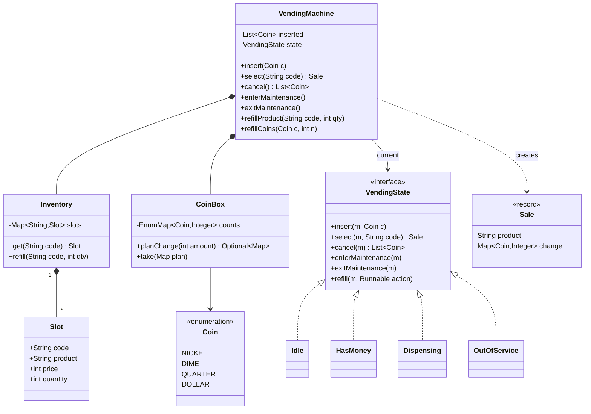

# Vending Machine: class diagram

```mermaid
classDiagram
    class VendingMachine {
        -List~Coin~ inserted
        -VendingState state
        +insert(Coin c)
        +select(String code) Sale
        +cancel() List~Coin~
        +enterMaintenance()
        +exitMaintenance()
        +refillProduct(String code, int qty)
        +refillCoins(Coin c, int n)
    }
    class VendingState {
        <<interface>>
        +insert(m, Coin c)
        +select(m, String code) Sale
        +cancel(m) List~Coin~
        +enterMaintenance(m)
        +exitMaintenance(m)
        +refill(m, Runnable action)
    }
    class Inventory {
        -Map~String,Slot~ slots
        +get(String code) Slot
        +refill(String code, int qty)
    }
    class Slot {
        +String code
        +String product
        +int price
        +int quantity
    }
    class CoinBox {
        -EnumMap~Coin,Integer~ counts
        +planChange(int amount) Optional~Map~
        +take(Map plan)
    }
    class Sale {
        <<record>>
        String product
        Map~Coin,Integer~ change
    }
    class Coin {
        <<enumeration>>
        NICKEL
        DIME
        QUARTER
        DOLLAR
    }

    VendingMachine *-- Inventory
    VendingMachine *-- CoinBox
    VendingMachine --> VendingState : current
    Inventory "1" *-- "*" Slot
    VendingState <|.. Idle
    VendingState <|.. HasMoney
    VendingState <|.. Dispensing
    VendingState <|.. OutOfService
    VendingMachine ..> Sale : creates
    CoinBox --> Coin
```
